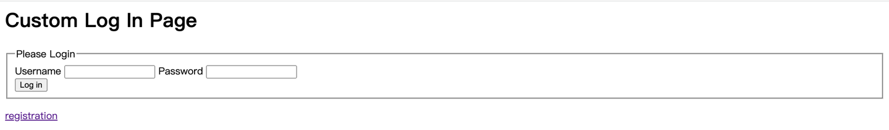
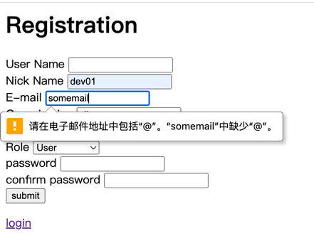

# Spring Security Login App

## 说明

Spring Security 是 Spring 全家桶中一个功能强大且高度可定制的身份验证和访问控制框架。与所有 Spring 项目一样，我们可以轻松扩展 Spring Security 以满足自定义要求。

由于 Spring Security 功能十分强大，且更新迭代较快，不同版本之间兼容性较差，相比于其他技术来说很难上手，很多刚接触 Spring Security 的开发者很难通过文档或者视频就能将其进行运用到实际开发中，而网上的教程很多是基于老版本的，其中很多特性也在新版本中逐渐被弃用了，更大大增加了学习成本。

我在课程实验中第一次接触到了Sprig Security的开发，一个简单的表单验证登录app也是费了3天的时间才完成，因此本项目也是课程实验迭代的产物。该Demo是一个简单的使用Spring Security框架，利用嵌入式H2数据库和Jp进行数据存储的，能够实现的登录、注册、注销功能的WEB App。

本项目有两个Application,其中`lab1_demo/src/main/java/CloseReview/CloseReviewApplication`为本Demo的App，实现的功能为用户的注册、登录、注销。`lab1_demo/src/main/java/person/Application`为一个简单的用户查询和修改接口，但是数据与本Demo并不互通，且不保证完整可用，因为两个demo共用一个`application.properties`,若想使用该功能，请从原仓库`V1`分支下载。

项目文档也在本文档中，考虑到也没什么人看，就在这里一并写了。

## Requirement
#### 使用：
>* Java 17
#### 开发：
>* Mavean
>* Spring boot=3.1.4
>>SPRING 依赖：
>>* JPA
>>* H2
>>* Web
>>* spring security=6.1.4


## Usage

```bash
#克隆本仓库的代码
git clone https://github.com/ssmisya/spring_security_login.git
cd spring_security_login/lab1_demo

#开启后端(MacOS)
#此处建议从idea启动后端，idea的base为文件夹'spring_security',防止它胡乱创建数据文件
sh ./mvnw clean spring-boot:run
#cli进行测试或使用浏览器进行测试
curl -v localhost:8080/
```

## 功能演示
#### 页面说明
>* `/`:主页(需要登录状态下才能查看)
>* `/login`:登录页面
>* `/registration`:注册页面
>* `/registration_error`:注册失败页面
>* `/H2`：数据库管理页面(需要管理员权限)
#### 登录

在未登录时，任何对非`/login`、`/registration`页面的访问都会被重定向到`/login`页面
，如图：




若登录失败，则会提示invalid,当你看到这个正在问候spring的神鹰黑手哥的时候，
就登录成功了。


需要注意的是登录时验证密码的时间耗费时间比较长，耐心等待不要刷新页面或狂点。

#### 登出

点集下面的`logout`按钮即可登出，登出后又会被重定向到`/login`页面

#### 注册
点击各个页面下方的"registration"超链接会被重定向到注册页面：


注册会对用户名是否为空，电子邮件是否符合格式进行静态检查：



但对于两次Password输入不匹配、用户已存在、用户名为空字符串进行运行时检查，注册失败将会被重定向到
`registration_error`界面，注册成功将会被重定向到登录界面。

## 项目文档

### 开发者登录方式
为了能够进行查看和管理数据库，可以使用开发账号进行登录网站，

| 用户名    | dev          |
|--------|--------------|
| **密码** | **password** |

### 代码文件说明
```bash
src
├── main
│   ├── java
│   │   ├── CloseReview       #demo的代码文件
│   │   │   ├── CloseReviewApplication.java   #application文件
│   │   │   ├── develop                       #用于定义一些便于开发的页面，在安全策略中定义为仅有管理员才能查看
│   │   │   │   └── DevelopController.java    #便于开发的页面的控制器               
│   │   │   ├── registration                  #注册功能的相关代码实现
│   │   │   │   ├── Exception                 #注册功能有关的异常定义
│   │   │   │   │   ├── NullUserNameException.java
│   │   │   │   │   ├── PasswordNotMatchException.java
│   │   │   │   │   └── UserAlreadyExistException.java
│   │   │   │   ├── MyJdbcUserDetailsManager.java     #重写的JdbcUserDetailsManager，用于实现注册数据与数据库之间的连通
│   │   │   │   ├── RegistrationController.java       #注册页面的控制器
│   │   │   │   └── UserDto.java                      #用于暂存注册时用户提交的信息，并对用户提交的信息进行静态检查
│   │   │   ├── repository                            #实体仓库类的相关实现文件
│   │   │   │   ├── LoadDatabase.java                 #预加载数据库
│   │   │   │   ├── UserRepository.java               #用户实体仓库
│   │   │   │   └── UserRoleRepository.java           #用户角色实体仓库
│   │   │   ├── security                              #安全控制策略的相关配置和方法实现
│   │   │   │   ├── IndexController.java              #主页(/)的控制器
│   │   │   │   ├── LoginController.java              #登录页(/login)的控制器
│   │   │   │   ├── SecurityConfiguration.java        #安全策略控制（重要）
│   │   │   │   └── WebMvcConfiguration.java          #Mvc网页策略控制
│   │   │   ├── user                                  #用户实体类（数据格式定义处）
│   │   │   │   ├── User.java                         #表“user_info”的定义处
│   │   │   │   └── UserRole.java                     #表"usr_role"的定义处
│   │   │   └── util                                  #暂时没用
│   │   └── person                                    #LAB1的相关内容
│   │       └── ... 
│   └── resources   
│       ├── application.properties                    #app的定义文件
│       ├── static                                    #里面包含了css和js文件     
│       └── templates                                 #thmleaf模板文件
│           ├── addStudent.html
│           ├── index.html                            #主页
│           ├── login.html                            #登录页
│           ├── registration.html                     #注册页
│           ├── registration_error.html               #注册错误页
│           ├── searchStudent.html
│           ├── showAll.html
│           └── updateBook.html
└── test
    └── java
        ├── CloseReview
        │   └── JdbcCustomizeDatasourceApplicationTests.java  #数据源Datasource连通性的测试类
        └── person
            └── ...
```


### 数据存储方式

本次采用H2数据库进行存储，H2数据库有三种存储方式，内存型、服务器型、和文件型；
因为每次生成数据会对密码进行加密，因此采用文件型进行存储，数据文件在`lab1_demo/db/*`。

数据库可以进行UI查看，URL为`/H2`，需要使用Administer登录才可以查看，在其中可以方便地对标进行操作。
由于demo采用的H2的数据库是内嵌的，因此可用JPA对其进行操作，即使用Entity的Repository来对其进行操作
即有两套scheme，是一一对应的关系。

H2的console如图：


当前共有两张表，User的数据的格式为：
```java
@Entity
@Table(name = "user_info")//使用user作为名字将导致报错，user是H2 SQL的保留字
public class User {

//    private static final long serialVersionUID = 3340373364530753417L;

    @Id
    @GeneratedValue(strategy = GenerationType.IDENTITY)
    private Long id;

    @Column(name = "user_name", columnDefinition = "varchar(100)", nullable = false, unique = true)
    private String userName;

    @Column(name = "nick_name", columnDefinition = "varchar(100)")
    private String nickName;

    @Column(name = "password", columnDefinition = "varchar(100)", nullable = false)
    private String password;

    @Column(name = "email", columnDefinition = "varchar(100)", nullable = false)
    private String email;

    @Column(name = "organization", columnDefinition = "varchar(100)", nullable = false)
    private String organization;

    @Column(name = "region", columnDefinition = "varchar(100)", nullable = false)
    private String region;

    @Column(name = "enabled", columnDefinition = "BOOL", nullable = false)
    private boolean enabled;
}
```

user_role的数据格式为：
```java
@Entity
@Table(name = "user_role")
public class UserRole {

    @Id
    @GeneratedValue(strategy = GenerationType.IDENTITY)
    private Long id;

    @Column(name = "user_name", columnDefinition = "varchar(100)", nullable = false)
    private String userName;

    @Column(name = "role", columnDefinition = "varchar(100)", length = 20, nullable = false)
    private String role;
}

```

### 安全验证策略

安全验证策略基本上都是通过`security/SecurityConfiguration`来定义的，在里面定义了例如放行。有条件放行的页面的URL设置，可以通过变更这里来配置
页面的访问，源码中定义了几类常用的策略，若需要其他的策略可以另行配置。

较重要的安全配置策略为
```java
 @Bean
    public SecurityFilterChain securityFilterChain(HttpSecurity http,
                                                   HandlerMappingIntrospector introspector) throws Exception {
        //http策略设置
        MvcRequestMatcher.Builder mvcMatcherBuilder = new MvcRequestMatcher.Builder(introspector);
        http.csrf(csrfConfigurer ->
                csrfConfigurer.ignoringRequestMatchers(mvcMatcherBuilder.pattern("/**"),
                        PathRequest.toH2Console()));
        http.headers(headersConfigurer ->
                headersConfigurer.frameOptions(HeadersConfigurer.FrameOptionsConfig::sameOrigin));
        //http放行策略设置
        http
                .authorizeRequests((authorize) -> authorize
                        //这里想要放行某个访问，当有2个servelet时(本实验是H2和demo两个servlet)只能用这种方法
                        .requestMatchers(new AntPathRequestMatcher("/registration")).permitAll()
                        //放行某个角色对某页面的访问
                        .requestMatchers(new AntPathRequestMatcher("/dev/**")).hasRole("Administer")
                        .requestMatchers(new AntPathRequestMatcher("/h2/**")).access("hasRole('Administer') or hasRole('DBA')")
//                        .requestMatchers(new AntPathRequestMatcher("/")).permitAll()
                        .anyRequest().authenticated()
                )
                //登录设置
                .formLogin((form) -> form
                        .loginPage("/login")
                        .permitAll()
                );
        http
                //logout设置
                .logout()
                .logoutUrl("/logout")
                .logoutSuccessUrl("/")
//                .logoutSuccessHandler(logoutSuccessHandler)
                .invalidateHttpSession(true);
//                .addLogoutHandler(logoutHandler)
//                .deleteCookies(cookieNamesToClear)
        // @formatter:on
        return http.build();
    }
```

其中spring security支持对不同页面对不同角色的用户开放，方法也如上所示，角色俄种类和数目未做限制，目前项目支持注册`User`/`PC Member`/`Chair`/`Author`
四种角色，而管理员(`Administer`)则需要手动添加，不支持注册。

### 用户管理策略

这里的用户管理策略主要是指后端服务器提供的一个用户信息操作的接口，主要包括addUser,addUserRole等方法，在这里执行对应的操作就可以直接将用户操作作用在
最终的数据库内，这里我重写了`JdbcUserDetailsManager`这一spring security提供的原生的JDBC用户管理类，并重载了其中的adduser方法，以适应本项目定义的
数据格式（因为本项目数据库的数据表格式与默认的数据表格式有区别）。重写的文件为`registration/MyjdbcUserDetailsManager`。

但是目前仅针对增加用户和增加用户特权提供了可靠性的支持，对于其他用户操作，可以参阅文档按需调用父类的方法

因此，增加用户的统一接口为：

```java
    //初始化jdbc用户信息管理对象
    MyJdbcUserDetailsManager users = new MyJdbcUserDetailsManager(dataSource);
        //用户注册统一接口
        try {
            //初始化待插入信息
            UserDto user = new UserDto(
                    "dev",
                    "dev",
                    "password",
                    "password",
                    "abc@somemail.com",
                    "fdu",
                    "China",
                    "ROLE_Administer"
            );
            //对密码进行加密
            user.encryptPassword(16);
            //插入用户至数据库
            users.createUser(user);
            }catch (UserAlreadyExistException | NullUserNameException | PasswordNotMatchException e){
            e.printStackTrace();
        }
```

这里采用了Jdbc的方法来管理数据库信息，本质上是一种长远的方案，也可以采用类似实验一中使用`repository`接口来管理用户的方案。

若要变更数据模式，则需要保证四个地方的数据一致性：

+ 1.数据表，即`user_info/user_role`两个表
+ 2.Entity 类，即`User/UserRole`两个类
+ 3.待插入用户类`UserDto`类
+ 4.确认UserDetailsManager提供的接口是否适配自己的数据模式，不适配需要重写

其中1和2的一致性较为容易保证，因为他们就是在一个文件中定义的，本质上是相同模式的两个名称，例如User在Java中叫`User`类
，但是在sql中却叫`user_info`,且每个column都有别名。

而且需要考虑密码的加密解密问题，可以使用`UserDto`类中的`encryptPassword(strength)`方法对`UserDto`中的密码进行加密
其他的时候可以使用加密Encoder。

demo中已经预载了一些用户可供调试使用：


### TODO

 - [x]  搭建好spring security框架
 - [x]  配置用户数据模式
 - [x]  注册及用户信息检查功能
 - [x]  登录功能
 - [x]  注销功能
-  [ ]  配置会议及论文数据模式
 - [ ]  会议申请功能  
 - [ ]  会议审核功能
 - [ ]  开启投稿功能
 - [ ]  论文投稿功能
 - [ ]  邀请PC Member功能


